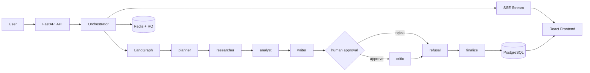

# Nexus Researcher


Nexus Researcher is a full-stack, stateful multi-agent orchestration system built with FastAPI, LangGraph, PostgreSQL, Redis, and React.

It is designed around production-oriented patterns that many demos skip:

- Durable run state with timeline + checkpoint persistence.
- Human-in-the-loop approval for high-impact runs.
- Real-time SSE streaming with replay semantics (`Last-Event-ID`).
- Idempotent start/resume controls.
- Token usage ledger + daily quota windows.
- Operational docs for release, incident response, and SLOs.

## Core Features

- Multi-agent flow: planner -> researcher -> analyst -> writer -> human_approval -> critic -> refusal -> finalize.
- Upload and parse source files (PDF, DOCX, TXT).
- Role-based access support (`admin`, `operator`, `reviewer`) with API key and JWT modes.
- Redis-backed fail-open rate limiting.
- Resume on human decision and budget top-up.
- Full API surface for run creation, tracking, timeline inspection, stopping, and continuation.

## Recent Improvements (2026-04)

**Dashboard Panels**: All dashboard screens now use live API data instead of mock values:
- Agent Pool: Real-time agent states (active/completed/idle) derived from run events
- Models Panel: Accurate stack disclosure (Ollama only, no cloud provider mocking)
- Settings Panel: Live health badges from `/api/health/ratelimit` endpoint
- Library Panel: Full file upload integration with session-based persistence

**Orchestration Graph**: Complete 8-node graph with refusal gate properly wired between analyst and finalize nodes.

**Run Timeline**: Improved UX for completed runs (clear navigation to Results tab instead of duplicate report).

**Approval Workflow**: Empty approval notes now fail gracefully with fallback message; rejection requires reason.

**Results Dashboard**: Post-run metrics scorecard (steps, tokens, revisions) now visible for terminal runs.

## Architecture



## Repository Layout

```text
.
├─ backend/                  # FastAPI app, orchestrator, DB models, migrations, tests
├─ frontend/                 # React + Vite UI and Playwright smoke tests
├─ docs/                     # Runbook, SLO/alerting, release checklist
├─ evals/                    # Promptfoo evaluators + test cases
├─ .github/workflows/ci.yml  # CI gates and strict gatekeeper
├─ docker-compose.yml        # Full local runtime stack
├─ .env.example              # Environment template
└─ README.md                 # Single source of project documentation
```

## Tech Stack

- Backend: FastAPI, SQLAlchemy, Pydantic v2, Alembic, Redis, RQ, LangGraph.
- Frontend: React 18, Vite 5, Tailwind CSS, Vitest, Playwright.
- Data/runtime: PostgreSQL 16, Redis 7, Ollama.
- Evaluation: Promptfoo with custom JS evaluators.
- Infra: Docker Compose.

## Prerequisites

- Docker + Docker Compose.
- Node.js 20+ (for local frontend commands).
- Python 3.11+ (for local backend commands).

## Quick Start

### Option 1: Docker Compose

```bash
cp .env.example .env
docker compose up --build
```

App URLs:

- Frontend: `http://localhost:5173`
- Backend API: `http://localhost:8000/api`

### Option 2: Startup Scripts

- Windows PowerShell: `./start.ps1`
- Linux/macOS: `./start.sh`

## Environment Configuration

Important variables are provided in `.env.example`:

- Runtime: `DATABASE_URL`, `REDIS_URL`, `OLLAMA_BASE_URL`, `OLLAMA_MODEL`.
- Security: `REQUIRE_API_KEY`, `API_KEY`, `AUTH_RBAC_V2`, `JWT_SECRET`.
- Reliability/governance: `RATE_LIMIT_ENABLED`, `TOKEN_LEDGER_V2`, `SSE_RESUME_V2`, `QUOTA_DAILY_TOKENS`, `IDEMPOTENCY_TTL_MINUTES`.
- CORS: `CORS_ALLOWED_ORIGINS`.

## API Surface

| Method | Path | Auth | Description |
|---|---|---|---|
| GET | `/api/health` | No | Service liveness check |
| GET | `/api/health/ratelimit` | No | Redis limiter status and counters |
| GET | `/api/metrics` | Yes | Aggregate system metrics |
| POST | `/api/uploads` | Yes | Upload source files and extract combined context |
| GET | `/api/runs` | Yes | List runs with filters and pagination |
| GET | `/api/runs/{run_id}` | Yes | Get current run status/details |
| GET | `/api/runs/{run_id}/timeline` | Yes | Retrieve persisted timeline events |
| POST | `/api/runs/stream` | Yes | Start a run and stream SSE events |
| POST | `/api/runs/{run_id}/resume/stream` | Yes | Resume approval-paused run via SSE |
| POST | `/api/runs/{run_id}/resume-budget/stream` | Yes | Resume budget-exhausted run with extra budget |
| POST | `/api/runs/{run_id}/stop` | Yes | Stop an active or paused run |

## Key Behaviors

**Library Panel**: Uploaded files are persisted in the session (in-memory) only. Files are not persisted to disk or database across page refreshes. Reload the page to clear the library.

**Language Model**: Ollama is the only supported LLM backend. To change the model, modify `OLLAMA_MODEL` in `.env` and restart containers. Cloud providers (OpenAI, Anthropic) are not integrated; extend the backend to add support.

**Health Status**: The Settings panel queries `/api/health/ratelimit` to show live PostgreSQL and Redis connection status. These are real-time checks, not cached values.

## Local Verification

Backend:

```bash
cd backend
python -m pytest tests -q
python -m compileall app
python -m alembic upgrade head
```

Frontend:

```bash
cd frontend
npm ci
npm run test
npm run test:e2e
npm run build
```

## Troubleshooting

### Docker stack will not start

- Confirm Docker Desktop is running and `docker compose ps` shows `backend`, `frontend`, `postgres`, `redis`, and `ollama`.
- Rebuild the stack from the repository root with `docker compose up --build -d`.
- Inspect recent failures with `docker compose logs --no-color --tail=100 backend worker frontend`.

### Backend health or migrations fail

- Check `GET /api/health` first to confirm the API is alive.
- If the database schema looks stale, run `docker compose exec -T backend alembic upgrade head`.
- If migration checks still fail in CI, validate that `alembic_version` contains a current revision after upgrade.

### Run stream returns 422 or stalls

- Ensure the request body matches the `POST /api/runs/stream` schema and that required auth headers are present when API keys are enabled.
- Watch backend and worker logs together so you can see both request acceptance and orchestrator execution.
- If the worker is healthy but the stream is empty, verify Redis connectivity and the queue consumer status.

### Dependency audit or test gates fail

- Re-run backend tests with `python -m pytest tests -q` and frontend tests with `npm run test`.
- Re-run dependency checks with `pip-audit --strict -r requirements.txt` and `npm audit --audit-level=high --omit=dev`.
- If `npm ci` or `pip install -r requirements.txt` changes the environment, repeat the tests before pushing.

## Performance Benchmarking

The main published performance target is the SLO for `POST /api/runs/stream`: p95 latency must stay at or below 1200ms excluding model runtime. See `docs/SLO_AND_ALERTING.md` for the full policy.

Suggested local checks:

```bash
# Baseline API responsiveness
curl -s -o NUL -w "health_total=%{time_total}\n" http://localhost:8000/api/health

# Measure stream acceptance timing from the API edge
curl -s -o NUL -w "stream_ttfb=%{time_starttransfer}\n" \
  -X POST http://localhost:8000/api/runs/stream \
  -H "Content-Type: application/json" \
  -H "X-API-Key: <your-api-key-if-required>" \
  -d '{"objective":"benchmark run","highImpact":false}'
```

For repeatable comparisons, run each check several times under the same Docker state and compare the median and p95 values rather than a single sample.

If you need a broader load test, measure the endpoint through an external tool such as `hey`, `wrk`, or `k6` and keep model execution excluded when comparing API overhead.

Dependency audits:

```bash
cd backend
pip install pip-audit
pip-audit --strict -r requirements.txt

cd ../frontend
npm audit --audit-level=high
```

## CI Gates

GitHub Actions workflow: `.github/workflows/ci.yml`

Required jobs:

- Backend tests
- Migration check
- Frontend unit tests
- Frontend e2e smoke
- Build checks (backend compile + frontend build)
- Dependency audit (pip-audit + npm audit)

The workflow includes a strict gatekeeper job (`Required Gates Check`) that fails when any required gate is not successful.

## Evaluation

Promptfoo evaluation assets live in `evals/` with repository-level config in `promptfoo.yaml`.

Run locally from `frontend/`:

```bash
npm run eval
npm run eval:view
```

## Operational Documentation

- `docs/SLO_AND_ALERTING.md`
- `docs/INCIDENT_RUNBOOK.md`
- `docs/RELEASE_CHECKLIST.md`

## Tradeoffs and Current Limits

- Ollama local inference is hardware-dependent and not horizontally scalable as-is.
- Single-region deployment model.
- Multi-tenant data isolation is not implemented yet.

## Security Notes

- Do not commit real secrets to `.env`.
- Use strong values for `API_KEY`, `JWT_SECRET`, and database credentials.
- Restrict CORS origins and disable legacy auth fallback in production if not required.

## License

This repository is intended as a portfolio-grade engineering project. Add or adjust license terms as needed for deployment or distribution.