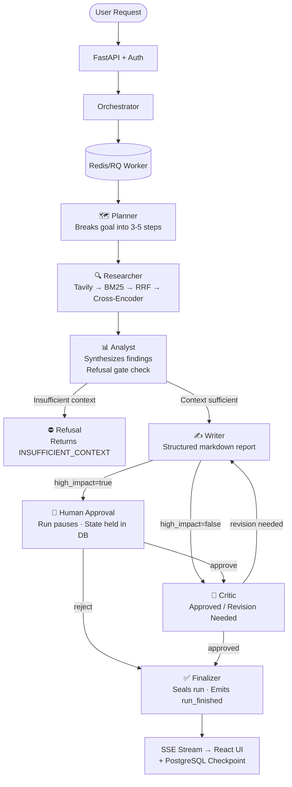

# Nexus Researcher


Nexus Researcher is a full-stack, stateful multi-agent orchestration system built with FastAPI, LangGraph, PostgreSQL, Redis, and React.

It is designed around production-oriented patterns that many demos skip:

- Durable run state with timeline + checkpoint persistence.
- Human-in-the-loop approval for high-impact runs.
- Real-time SSE streaming with replay semantics (`Last-Event-ID`).
- Idempotent start/resume controls.
- Token usage ledger + daily quota windows.
- Operational docs for release, incident response, and SLOs.

## Core Features

- Multi-agent flow: planner -> researcher -> analyst -> writer -> human_approval -> critic -> refusal -> finalize.
- Upload and parse source files (PDF, DOCX, TXT).
- Role-based access support (`admin`, `operator`, `reviewer`) with API key and JWT modes.
- Redis-backed fail-open rate limiting.
- Resume on human decision and budget top-up.
- Full API surface for run creation, tracking, timeline inspection, stopping, and continuation.

## Recent Improvements (2026-04)

**Dashboard Panels**: All dashboard screens now use live API data instead of mock values:
- Agent Pool: Real-time agent states (active/completed/idle) derived from run events
- Models Panel: Accurate stack disclosure (Ollama only, no cloud provider mocking)
- Settings Panel: Live health badges from `/api/health/ratelimit` endpoint
- Library Panel: Full file upload integration with session-based persistence

**Orchestration Graph**: Complete 8-node graph with refusal gate properly wired between analyst and finalize nodes.

**Run Timeline**: Improved UX for completed runs (clear navigation to Results tab instead of duplicate report).

**Approval Workflow**: Empty approval notes now fail gracefully with fallback message; rejection requires reason.

**Results Dashboard**: Post-run metrics scorecard (steps, tokens, revisions) now visible for terminal runs.

A stateful multi-agent research orchestration system built with LangGraph, hybrid retrieval, PostgreSQL persistence, and human-in-the-loop approval — designed around the patterns that production AI systems require: cost governance, refusal gating, auditable state, and run recovery.

## What This Actually Does

A user submits a research objective and an optional token budget. The system initializes a run, then streams eight specialized agent nodes through a LangGraph workflow over SSE: a Planner breaks down the goal, a Researcher executes live Tavily web search and keyword retrieval with reranking, an Analyst synthesizes findings and decides whether evidence is sufficient, a Writer produces a structured markdown report, a Human Approval node pauses high-impact runs for review, a Critic evaluates the draft and can trigger revision loops, a Refusal node terminates with `INSUFFICIENT_CONTEXT` if evidence falls below threshold, and a Finalizer seals the run. Every state transition is checkpointed to PostgreSQL and replayed via SSE `Last-Event-ID` on reconnect. Runs can be resumed after human decision or token budget top-up.

## Architecture



Each node update is persisted as a `RunCheckpoint` before the stream continues. The React frontend reconstructs the timeline from stored events on reconnect.

## Why This Is Different

**1. Four-stage retrieval pipeline, not a single embedding lookup.**
Most RAG systems call one vector similarity function and return results. The Researcher node executes Tavily web search, applies BM25 over the returned documents, fuses both ranking lists with Reciprocal Rank Fusion (`rrf_k=60`), and finally reranks the top candidates with a cross-encoder (`cross-encoder/ms-marco-MiniLM-L-6-v2`). Each stage catches a different failure mode: vector search misses exact keyword hits, BM25 misses semantic similarity, RRF stabilizes the merge, and the cross-encoder scores query–document relevance jointly. This is the retrieval architecture used in production search systems.

**2. Refusal gating is a first-class architectural node, not an afterthought.**
When the Analyst determines that retrieved evidence is below threshold, the graph routes to a dedicated Refusal node that terminates with `INSUFFICIENT_CONTEXT`. No LLM call is made, no hallucinated answer is returned, and the refusal is logged as a traceable timeline event.

**3. SSE with `Last-Event-ID` replay — not a polling loop.**
The stream endpoint emits structured `timeline`, `awaiting_approval`, and `run_finished` SSE events. Each event carries a monotone sequence number. On reconnect, the client sends `Last-Event-ID`, and the server replays persisted events from that point forward. Idempotency keys on run-start prevent duplicate runs from fast-clicking clients.

**4. Token ledger with daily quota windows prevents silent cost blowouts.**
Every LLM call charges tokens against a per-run budget (`token_budget_remaining`). The orchestrator also aggregates usage into a per-subject daily quota (`QUOTA_DAILY_TOKENS`, default 200,000). Runs that exhaust their budget halt at the next node boundary and transition to `budget_exhausted` status; they can be resumed with an explicit budget top-up via `POST /api/runs/{id}/resume-budget/stream`.

**5. Every major decision is documented as an Architecture Decision Record.**
Five ADRs explain the rationale behind LangGraph selection, SSE transport, fail-open Redis rate limiting, checkpoint-per-step persistence, and tool-based web search. Writing them down with alternatives considered and tradeoffs named makes a system maintainable by someone who wasn't in the room.

## Full Tech Stack

| Component | Technology | Reason |
|---|---|---|
| Agent orchestration | LangGraph (StateGraph) | Explicit node/edge model; human approval is a native graph node, not a hack |
| API framework | FastAPI + Uvicorn | Async-native; SSE via `StreamingResponse` with no extra infrastructure |
| Database | PostgreSQL 16 + SQLAlchemy 2 + Alembic | Durable run state; Alembic fail-fast migration check on production startup |
| Task queue | Redis 7 + RQ | Decouples HTTP response from long-running graph execution |
| Rate limiter | Redis fixed-window (fail-open) | Service stays up during Redis outages; counters expose fail-open events |
| Auth | JWT (HS256) + API key, dual-mode | JWT RBAC for multi-user; API key for CI and single-operator setups |
| Web search | Tavily API (optional) | Structured results with URL and content; degrades to placeholder when absent |
| Keyword retrieval | rank-bm25 (BM25Okapi) | Captures exact lexical matches that vector search misses |
| Reranking | cross-encoder/ms-marco-MiniLM-L-6-v2 | Jointly scores query–document pairs; lazy-loaded, fail-open |
| Tracing | LangSmith (opt-in, `LANGSMITH_ENABLED`) | Span-level trace of every Ollama call and retrieval step |
| Eval framework | Promptfoo with custom JS evaluators | Adversarial tests in CI; prompt injection, refusal accuracy, grounded pass rate |
| LLM inference | Ollama (local, configurable model) | No external API cost for local development; supports any Ollama-compatible model |
| Content sniffing | python-magic (magic-byte inspection) | Rejects disguised executables on file upload |
| Frontend | React 18 + Vite + Tailwind CSS | Real-time SSE consumer, timeline UI, approval workflow, graph visualizer, metrics dashboard |
| CI | GitHub Actions (Python 3.11 / 3.12 / 3.14 canary) | Per-subsystem coverage thresholds; warning budget gate on canary Python |

## Real Metrics

| Metric | Value | Notes |
|---|---|---|
| Backend test suite | 122 tests | Unit + integration tests; `pytest` |
| Frontend test suite | Unit + E2E | Vitest (unit) + Playwright (E2E smoke) |
| Load test throughput | 8.05 req/s aggregated, 0% failures | Locust headless: 10 users, spawn-rate 2, run-time 2m |
| Load test scenario 1 (baseline) | TTFB p50 6.28ms / p95 8.68ms | 43 sampled single-user streamed runs |
| Load test scenario 2 (concurrent) | /api/runs/stream p50 4ms / p95 7ms / p99 33ms | 252 concurrent requests; 10-user run |
| Load test scenario 3 (SSE reconnect) | 0/42 successful | Insufficient timeline depth in test environment |
| Load test scenario 4 (budget exhaustion) | 0/42 reached exhausted status | API minimum budget insufficient for exhaustion in test load |
| Load test scenario 5 (idempotency) | 41/42 same run_id on duplicate | Dual-submit with same objective + idempotency key |
| Python versions | 3.11, 3.12, 3.14 canary | CI matrix; warning budget gate on canary |
| Cache hit latency | ~2ms | Normalized query cache in-memory response |
| Node execution latency | ~200–800ms per node | Ollama-dependent; model load dominates first call |

---

## Getting Started

### Prerequisites

- Docker and Docker Compose
- Tavily API key (free tier, optional; system degrades to static fallback without it)

### 1. Clone and configure

```bash
git clone https://github.com/<owner>/nexus-researcher.git
cd nexus-researcher/NEXUS_R_Main
cp .env.example .env
```

Edit `.env` and set **required** variables:

```env
# Required
POSTGRES_USER=nexus
POSTGRES_PASSWORD=your_db_password
POSTGRES_DB=nexus
API_KEY=your_strong_random_api_key
JWT_SECRET=your_strong_jwt_secret

# Optional — enables live web search. Without this, runs use a static placeholder.
TAVILY_API_KEY=tvly-...

# Optional — enables LangSmith tracing
LANGSMITH_API_KEY=ls__...
LANGSMITH_ENABLED=false
```

### 2. Start the stack

```bash
docker compose up --build
```

This brings up PostgreSQL, Redis, Ollama, a backend API server, an RQ worker, and the React frontend. Alembic migrations run automatically on backend startup. Ollama model download on first run may take a few minutes.

| Service | URL |
|---|---|
| Frontend | http://localhost:5173 |
| Backend API | http://localhost:8000/api |
| Health check | http://localhost:8000/api/health |

### 3. Start your first run

**Via curl:**

```bash
curl -X POST http://localhost:8000/api/runs/stream \
  -H "X-API-Key: <your_api_key>" \
  -H "Content-Type: application/json" \
  -d '{
    "objective": "Summarize the current state of LangGraph in production systems",
    "high_impact": false,
    "token_budget": 8000
  }' \
  --no-buffer
```

You will see a live SSE stream of `run_started`, `timeline` (one per node), and `run_finished` events.

**Via UI:**

Open http://localhost:5173, submit your research objective through the Mission Control interface, and watch the agent timeline in real time.

### 4. Run the test suite

```bash
cd backend
python -m pytest tests -q
```

Expected result: **122 passed, 0 failed**.

### 5. Run adversarial evals

```bash
cd evals
npm run eval
npm run eval:view    # opens HTML report
```

---

## Project Structure

```
NEXUS_R_Main/
├── backend/
│   ├── app/
│   │   ├── agents/
│   │   │   ├── graph.py        # LangGraph StateGraph + routing logic
│   │   │   ├── nodes.py        # All 8 node implementations
│   │   │   └── tools.py        # web_search, bm25_search, rerank
│   │   ├── api/
│   │   │   └── routes.py       # All HTTP + SSE endpoints (15 total)
│   │   ├── core/
│   │   │   ├── orchestrator.py # Run lifecycle, SSE emission, token ledger
│   │   │   ├── auth.py         # JWT + API key dual-mode auth
│   │   │   ├── rate_limiter.py # Redis fail-open fixed-window limiter
│   │   │   ├── state.py        # AgentState TypedDict
│   │   │   ├── cache.py        # In-memory response cache with deterministic keys
│   │   │   ├── logging.py      # Structured JSON logging with correlation IDs
│   │   │   ├── tracing.py      # LangSmith opt-in span wrappers
│   │   │   └── settings.py     # Pydantic settings from environment
│   │   └── db/
│   │       ├── repository.py   # persist_step, consume_quota_tokens, recover_run
│   │       └── models.py       # SQLAlchemy ORM for Run, RunEvent, RunCheckpoint
│   ├── tests/
│   │   ├── unit/               # 100+ unit tests (nodes, tools, auth, quota, cache, tracing)
│   │   ├── integration/        # Run lifecycle, API contracts, e2e workflows
│   │   ├── load/               # Locust load-test suite with 5 scenarios
│   │   └── conftest.py         # Pytest fixtures (client, monkeypatch, etc.)
│   ├── alembic/                # Migration history for schema changes
│   ├── requirements.txt        # Python dependencies (FastAPI, LangGraph, SQLAlchemy, etc.)
│   └── Dockerfile
├── frontend/
│   ├── src/
│   │   ├── components/         # React components (Timeline, ApprovalUI, GraphViz, etc.)
│   │   ├── pages/              # Page routes (Home, Results, Settings, Library)
│   │   ├── hooks/              # Custom hooks (useSSEStream, useRunStatus, etc.)
│   │   ├── services/           # API client, SSE consumer
│   │   ├── types/              # TypeScript interfaces
│   │   └── App.tsx
│   ├── tests/                  # Vitest unit tests + Playwright e2e smoke tests
│   ├── package.json
│   ├── vite.config.js          # Vite build config
│   ├── tailwind.config.js      # Tailwind CSS customization
│   └── Dockerfile
├── evals/
│   ├── nexus-test-cases.yaml   # 18 test cases (4 categories: correctness, safety, grounding, refusal)
│   ├── evaluators.js           # 5 custom JS evaluators (no LLM scoring)
│   ├── promptfoo.yaml          # Promptfoo config
│   └── package.json
├── docs/
│   ├── adr/                    # 5 Architecture Decision Records
│   ├── INCIDENT_RUNBOOK.md     # On-call incident response procedures
│   ├── RELEASE_CHECKLIST.md    # Pre-release validation steps
│   └── SLO_AND_ALERTING.md     # Service Level Objectives + alert policies
├── .github/workflows/
│   └── ci.yml                  # GitHub Actions: tests, migrations, build, audit, gates
├── docker-compose.yml          # Full stack: PostgreSQL, Redis, Ollama, backend, worker, frontend
├── .env.example                # Template for environment variables
├── Makefile                    # make load-test, make test, make lint, etc.
├── start.ps1                   # Windows startup script
└── start.sh                    # Linux/macOS startup script
```

---

## API Surface

| Method | Path | Auth | Description |
|---|---|---|---|
| GET | `/api/health` | No | Liveness check |
| GET | `/api/health/ratelimit` | No | Redis limiter status and fail-open counters |
| GET | `/api/metrics` | Yes | Aggregate run metrics |
| POST | `/api/uploads` | Yes | Upload PDF/DOCX/TXT; magic-byte content sniffing rejects disguised files |
| GET | `/api/runs` | Yes | List runs with filters and pagination |
| GET | `/api/runs/{run_id}` | Yes | Run status and details |
| GET | `/api/runs/{run_id}/timeline` | Yes | Persisted timeline events (supports SSE replay) |
| POST | `/api/runs/stream` | Yes | Start a run and stream SSE events |
| POST | `/api/runs/{run_id}/resume/stream` | Yes | Post human decision and resume approval-paused run |
| POST | `/api/runs/{run_id}/resume-budget/stream` | Yes | Top up token budget and resume budget-exhausted run |
| POST | `/api/runs/{run_id}/stop` | Yes | Halt an active run |

Auth accepts `X-API-Key` header or `Authorization: Bearer <token>`. With `AUTH_RBAC_V2=true`, JWT tokens carry `sub` and `role` claims used for per-subject quota tracking.

---

## Architecture Decision Records

| ADR | Decision | One-line Summary |
|---|---|---|
| [ADR-001](docs/adr/ADR-001-fail-open-rate-limiting-with-redis.md) | Fail-open Redis rate limiter | Redis outage allows traffic through; counters expose fail-open events to operators |
| [ADR-002](docs/adr/ADR-002-server-sent-events-for-streaming.md) | SSE over WebSockets | One-way server push with HTTP replay semantics; simpler for proxies and reconnect logic |
| [ADR-003](docs/adr/ADR-003-langgraph-for-agent-orchestration.md) | LangGraph over imperative or CrewAI | Explicit named nodes and edges; human approval is a native first-class step |
| [ADR-004](docs/adr/ADR-004-checkpoint-every-state-transition.md) | Checkpoint per state transition | Runs are resumable from any step; timeline UI reconstructs from stored events on reconnect |
| [ADR-005](docs/adr/ADR-005-tool-based-web-search-inside-agent-nodes.md) | Web search inside agent node, not API layer | Search stays within the workflow model; degrades gracefully when Tavily is absent |

---

## CI and Quality Gates

GitHub Actions workflow: `.github/workflows/ci.yml`

**Required gates that must pass before merge:**

1. **Backend tests** — `python -m pytest tests -q` on Python 3.11
2. **Migration check** — Alembic `upgrade head` against a real PostgreSQL 16 instance; validates `alembic_version` table
3. **Frontend unit tests** — `npm run test` (Vitest)
4. **Frontend E2E smoke** — `npm run test:e2e` (Playwright on Chromium)
5. **Build gates** — Backend compile check + frontend production build
6. **Dependency audit** — `pip-audit --strict` on backend + `npm audit --audit-level=high` on frontend
7. **Required gates check** — Fails if any of the above is unsuccessful

Python version matrix: 3.11 (primary), 3.12 (secondary), 3.14 canary. Canary failures are logged but do not block merge (warning budget gate).

---

## Operational Documentation

- [INCIDENT_RUNBOOK.md](docs/INCIDENT_RUNBOOK.md) — On-call response, debugging playbooks, escalation procedures
- [RELEASE_CHECKLIST.md](docs/RELEASE_CHECKLIST.md) — Pre-release validation, database migration strategy, rollback plan
- [SLO_AND_ALERTING.md](docs/SLO_AND_ALERTING.md) — Service Level Objectives, alert definitions, error budgets

---

## What I Learned Building This

[YOUR REFLECTION HERE]

The hardest part was not building any single component — it was making them compose correctly under failure. SSE resume semantics sound simple until you realize the client reconnects mid-stream and you have to decide what "resume" actually means when a node is still running on the server. I ended up modeling events with monotone sequence numbers, so reconnecting clients send `Last-Event-ID` and the server replays from a known point.

Refusal gating was similarly subtle. The first version let the LLM decide when to refuse, which made refusal behavior unpredictable and untestable. Moving it to the graph level — as a deterministic node that activates when the Analyst's evidence falls below a measurable threshold — made it testable and tunable without touching prompts.

Reranking with a cross-encoder is expensive on cold start, so I added module-level lazy load with fail-open fallback: if sentence-transformers isn't available or the model fails to load, the function returns the RRF-fused results without crashing. That pattern — fail open with a logged warning, not an exception — shows up throughout the system because a partially degraded answer is almost always better than a 500 error.

The token ledger taught me that quota tracking and budget enforcement are different problems. A budget is per-run and stops execution. A quota is per-user per-day and shapes pricing. Conflating them produces bugs where exceeding a daily limit kills an unrelated run. Separating them into distinct fields in `AgentState` and distinct DB writes in the repository made the behavior clear and testable.

---

## Known Limitations and Future Work

**Current limitations:**

- Ollama inference is hardware-dependent and not horizontally scalable as-is.
- Single-region deployment model (no multi-region failover).
- Multi-tenant data isolation is not yet implemented; single tenant per deployment.
- Persistent user knowledge base (long-term memory) is not yet implemented.
- Async task queue (RQ) runs in process with the API; no separate worker fleet.

**Tradeoffs:**

- Frontend file upload (PDF, DOCX, TXT) is session-only; files are not persisted across page refreshes.
- Tavily API is optional; the system falls back to a static placeholder search result without it.
- LangSmith tracing is opt-in; no built-in metrics dashboard (see `/api/metrics` for Prometheus-compatible aggregates).

---
## Troubleshooting

### Docker stack will not start

- Confirm Docker Desktop is running and `docker compose ps` shows `backend`, `frontend`, `postgres`, `redis`, and `ollama`.
- Rebuild the stack from the repository root with `docker compose up --build -d`.
- Inspect recent failures with `docker compose logs --no-color --tail=100 backend worker frontend`.

### Backend health or migrations fail

- Check `GET /api/health` first to confirm the API is alive.
- If the database schema looks stale, run `docker compose exec -T backend alembic upgrade head`.
- If migration checks still fail in CI, validate that `alembic_version` contains a current revision after upgrade.

### Run stream returns 422 or stalls

- Ensure the request body matches the `POST /api/runs/stream` schema and that required auth headers are present when API keys are enabled.
- Watch backend and worker logs together so you can see both request acceptance and orchestrator execution.
- If the worker is healthy but the stream is empty, verify Redis connectivity and the queue consumer status.

### Dependency audit or test gates fail

- Re-run backend tests with `python -m pytest tests -q` and frontend tests with `npm run test`.
- Re-run dependency checks with `pip-audit --strict -r requirements.txt` and `npm audit --audit-level=high --omit=dev`.
- If `npm ci` or `pip install -r requirements.txt` changes the environment, repeat the tests before pushing.

## Performance Benchmarking

The main published performance target is the SLO for `POST /api/runs/stream`: p95 latency must stay at or below 1200ms excluding model runtime. See `docs/SLO_AND_ALERTING.md` for the full policy.

## Quick Reference

Start the full stack:

```bash
cd NEXUS_R_Main && docker compose up --build
```

Run all backend tests:

```bash
cd NEXUS_R_Main/backend && python -m pytest tests -q
```

Run load tests (Locust, headless):

```bash
cd NEXUS_R_Main && make load-test
# or: python -m locust -f backend/tests/load/locustfile.py \
#     --host http://127.0.0.1:8000 --headless --users 10 --spawn-rate 2 --run-time 2m
```

Check migration status:

```bash
cd NEXUS_R_Main/backend && alembic current
```

Run adversarial evals:

```bash
cd NEXUS_R_Main/evals && npm run eval && npm run eval:view
```

Tail backend logs:

```bash
docker compose -f NEXUS_R_Main/docker-compose.yml logs -f backend
```

---

## License

MIT. Built as a portfolio project by Mehedi Hasan, BRAC University, Dhaka, Bangladesh.

---

[GitHub](https://github.com/<owner>/nexus-researcher) · [LinkedIn](https://linkedin.com/in/<your-linkedin>) · Built April 2026