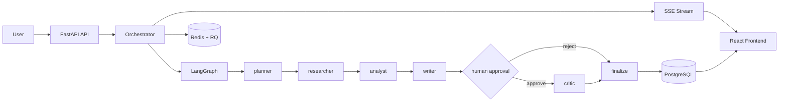

# Nexus Researcher

Nexus Researcher is a full-stack, stateful multi-agent orchestration system built with FastAPI, LangGraph, PostgreSQL, Redis, and React.

It is designed around production-oriented patterns that many demos skip:

- Durable run state with timeline + checkpoint persistence.
- Human-in-the-loop approval for high-impact runs.
- Real-time SSE streaming with replay semantics (`Last-Event-ID`).
- Idempotent start/resume controls.
- Token usage ledger + daily quota windows.
- Operational docs for release, incident response, and SLOs.

## Core Features

- Multi-agent flow: planner -> researcher -> analyst -> writer -> human_approval -> critic -> finalize.
- Upload and parse source files (PDF, DOCX, TXT).
- Role-based access support (`admin`, `operator`, `reviewer`) with API key and JWT modes.
- Redis-backed fail-open rate limiting.
- Resume on human decision and budget top-up.
- Full API surface for run creation, tracking, timeline inspection, stopping, and continuation.

## Architecture



## Repository Layout

```text
.
├─ backend/                  # FastAPI app, orchestrator, DB models, migrations, tests
├─ frontend/                 # React + Vite UI and Playwright smoke tests
├─ docs/                     # Runbook, SLO/alerting, release checklist
├─ evals/                    # Promptfoo evaluators + test cases
├─ .github/workflows/ci.yml  # CI gates and strict gatekeeper
├─ docker-compose.yml        # Full local runtime stack
├─ .env.example              # Environment template
└─ README.md                 # Single source of project documentation
```

## Tech Stack

- Backend: FastAPI, SQLAlchemy, Pydantic v2, Alembic, Redis, RQ, LangGraph.
- Frontend: React 18, Vite 5, Tailwind CSS, Vitest, Playwright.
- Data/runtime: PostgreSQL 16, Redis 7, Ollama.
- Evaluation: Promptfoo with custom JS evaluators.
- Infra: Docker Compose.

## Prerequisites

- Docker + Docker Compose.
- Node.js 20+ (for local frontend commands).
- Python 3.11+ (for local backend commands).

## Quick Start

### Option 1: Docker Compose

```bash
cp .env.example .env
docker compose up --build
```

App URLs:

- Frontend: `http://localhost:5173`
- Backend API: `http://localhost:8000/api`

### Option 2: Startup Scripts

- Windows PowerShell: `./start.ps1`
- Linux/macOS: `./start.sh`

## Environment Configuration

Important variables are provided in `.env.example`:

- Runtime: `DATABASE_URL`, `REDIS_URL`, `OLLAMA_BASE_URL`, `OLLAMA_MODEL`.
- Security: `REQUIRE_API_KEY`, `API_KEY`, `AUTH_RBAC_V2`, `JWT_SECRET`.
- Reliability/governance: `RATE_LIMIT_ENABLED`, `TOKEN_LEDGER_V2`, `SSE_RESUME_V2`, `QUOTA_DAILY_TOKENS`, `IDEMPOTENCY_TTL_MINUTES`.
- CORS: `CORS_ALLOWED_ORIGINS`.

## API Surface

| Method | Path | Auth | Description |
|---|---|---|---|
| GET | `/api/health` | No | Service liveness check |
| GET | `/api/health/ratelimit` | No | Redis limiter status and counters |
| GET | `/api/metrics` | Yes | Aggregate system metrics |
| POST | `/api/uploads` | Yes | Upload source files and extract combined context |
| GET | `/api/runs` | Yes | List runs with filters and pagination |
| GET | `/api/runs/{run_id}` | Yes | Get current run status/details |
| GET | `/api/runs/{run_id}/timeline` | Yes | Retrieve persisted timeline events |
| POST | `/api/runs/stream` | Yes | Start a run and stream SSE events |
| POST | `/api/runs/{run_id}/resume/stream` | Yes | Resume approval-paused run via SSE |
| POST | `/api/runs/{run_id}/resume-budget/stream` | Yes | Resume budget-exhausted run with extra budget |
| POST | `/api/runs/{run_id}/stop` | Yes | Stop an active or paused run |

## Local Verification

Backend:

```bash
cd backend
python -m pytest tests -q
python -m compileall app
python -m alembic upgrade head
```

Frontend:

```bash
cd frontend
npm ci
npm run test
npm run test:e2e
npm run build
```

Dependency audits:

```bash
cd backend
pip install pip-audit
pip-audit --strict -r requirements.txt

cd ../frontend
npm audit --audit-level=high
```

## CI Gates

GitHub Actions workflow: `.github/workflows/ci.yml`

Required jobs:

- Backend tests
- Migration check
- Frontend unit tests
- Frontend e2e smoke
- Build checks (backend compile + frontend build)
- Dependency audit (pip-audit + npm audit)

The workflow includes a strict gatekeeper job (`Required Gates Check`) that fails when any required gate is not successful.

## Evaluation

Promptfoo evaluation assets live in `evals/` with repository-level config in `promptfoo.yaml`.

Run locally from `frontend/`:

```bash
npm run eval
npm run eval:view
```

## Operational Documentation

- `docs/SLO_AND_ALERTING.md`
- `docs/INCIDENT_RUNBOOK.md`
- `docs/RELEASE_CHECKLIST.md`

## Tradeoffs and Current Limits

- Ollama local inference is hardware-dependent and not horizontally scalable as-is.
- Single-region deployment model.
- Multi-tenant data isolation is not implemented yet.

## Security Notes

- Do not commit real secrets to `.env`.
- Use strong values for `API_KEY`, `JWT_SECRET`, and database credentials.
- Restrict CORS origins and disable legacy auth fallback in production if not required.

## License

This repository is intended as a portfolio-grade engineering project. Add or adjust license terms as needed for deployment or distribution.