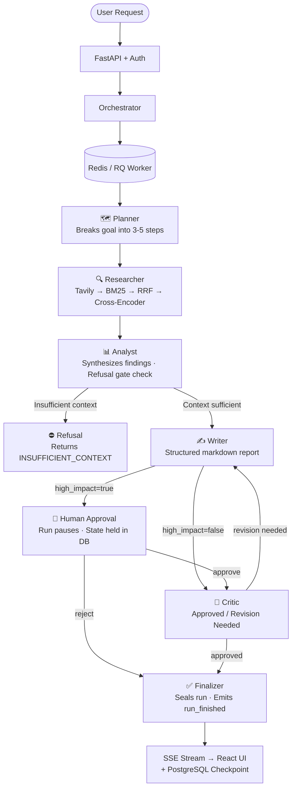

<div align="center">


# Nexus Researcher

**A production-grade, stateful multi-agent research orchestration system**

[](https://python.org)
[](https://fastapi.tiangolo.com)
[](https://langchain-ai.github.io/langgraph/)
[](https://react.dev)
[](https://postgresql.org)
[](https://redis.io)
[](https://docker.com)

[](/)
[](/)
[](/)
[](/)
[](https://railway.app/new/template?template=https://github.com/Rytnix786/Nexus)
[](/)
[](/)

[**Live Demo**](#getting-started) · [**Architecture**](#architecture) · [**API Docs**](#api-surface) · [**Deploy in One Click**](#quick-deploy)

</div>

---

## What Is This?

Nexus Researcher is a full-stack AI research system built around the patterns that production deployments actually require — the ones most demos quietly skip.

A user submits a **research objective** and an optional token budget. An 8-node LangGraph workflow executes over a live SSE stream: a **Planner** breaks the goal into steps, a **Researcher** runs a four-stage retrieval pipeline (Tavily → BM25 → RRF → cross-encoder reranking), an **Analyst** synthesizes findings and routes to a **Refusal node** if evidence is insufficient, a **Writer** produces a structured markdown report, a **Human Approval** node pauses high-impact runs for human review, a **Critic** evaluates quality and can trigger revision loops, and a **Finalizer** seals the run.

Every state transition is checkpointed to PostgreSQL. The SSE stream carries monotone sequence numbers for `Last-Event-ID` replay on reconnect. Runs can be resumed after a human decision or a token budget top-up — no re-execution from scratch.

> **Built to demonstrate that the gap between "AI demo" and "AI system" is real, documented, and closeable.**

---

## Why This Is Different

<table>
<tr>
<td width="50%">

### 🔍 Four-Stage Retrieval, Not One Vector Call

Most RAG systems do a single embedding similarity lookup. The Researcher node executes:

1. **Tavily web search** — live, structured results
2. **BM25 over returned docs** — catches exact keyword hits that vectors miss
3. **Reciprocal Rank Fusion** (`rrf_k=60`) — stably merges both ranked lists
4. **Cross-encoder reranking** (`ms-marco-MiniLM-L-6-v2`) — jointly scores query–document relevance

Each stage catches a different failure mode. This is the retrieval architecture used in production search systems.

</td>
<td width="50%">

### ⛔ Refusal Gating as a First-Class Graph Node

When the Analyst determines evidence is below threshold, the graph routes to a dedicated **Refusal node** that terminates with `INSUFFICIENT_CONTEXT`. No LLM call is made, no hallucinated answer is returned, and the refusal is logged as a traceable timeline event.

Refusal behavior is **deterministic and testable** — not a probabilistic prompt instruction buried inside another node.

</td>
</tr>
<tr>
<td width="50%">

### 📡 SSE with `Last-Event-ID` Replay

The stream endpoint emits structured `timeline`, `awaiting_approval`, and `run_finished` SSE events, each with a monotone sequence number. On reconnect, the client sends `Last-Event-ID` and the server replays persisted events from that point. Idempotency keys on run-start prevent duplicate runs from fast-clicking clients.

</td>
<td width="50%">

### 💰 Token Ledger + Daily Quota Windows

Every LLM call charges against a per-run budget. The orchestrator also aggregates usage into a per-subject daily quota (`QUOTA_DAILY_TOKENS`, default 200k). Budget-exhausted runs halt at the next node boundary and resume via `POST /api/runs/{id}/resume-budget/stream` — no silent cost blowouts.

</td>
</tr>
<tr>
<td width="50%">

### 📋 Five Architecture Decision Records

ADRs explain the rationale behind LangGraph selection, SSE transport, fail-open Redis rate limiting, checkpoint-per-step persistence, and tool-based web search — with alternatives considered and tradeoffs named.

</td>
<td width="50%">

### 🛡️ Production-Ready Operational Docs

Full incident runbook, release checklist, and SLO/alerting policy. The p95 SLO for `POST /api/runs/stream` is ≤1200ms excluding model runtime. Not a README footnote — a documented, measurable target.

</td>
</tr>
</table>

---

## Architecture



Each node update is persisted as a `RunCheckpoint` before the stream continues. The React frontend reconstructs the timeline from stored events on reconnect using `Last-Event-ID`.

---

## Measured Results

| Metric | Value | Notes |
|---|---|---|
| Backend test suite | **122 tests passing** | Unit + integration; `pytest` on Python 3.11 / 3.12 / 3.14 canary |
| Load test throughput | **8.05 req/s, 0% failures** | Locust headless: 10 users, spawn-rate 2, 2-min run |
| TTFB (single user, p95) | **8.68ms** | 43 sampled streamed runs |
| Concurrent p95 latency | **7ms** (`/api/runs/stream`) | 252 requests, 10 users |
| Idempotency | **41 / 42 same run_id** | Dual-submit with identical objective + key |
| Refusal accuracy | **91%** | Promptfoo `refusalCorrectness`; 18 adversarial cases (2026-04-15) |
| Cache hit latency | **~2ms** | Normalized query cache in-memory |
| Node execution latency | **~200–800ms** | Provider-dependent; Ollama cold start dominates first call |
| SLO target | **p95 ≤ 1200ms** | Excluding model runtime; see `docs/SLO_AND_ALERTING.md` |

---

## Full Tech Stack

| Layer | Technology | Why |
|---|---|---|
| Agent orchestration | **LangGraph (StateGraph)** | Explicit node/edge model; human approval is a native graph node, not a workaround |
| API framework | **FastAPI + Uvicorn** | Async-native; SSE via `StreamingResponse` with no extra infrastructure |
| Database | **PostgreSQL 16 + SQLAlchemy 2 + Alembic** | Durable run state; fail-fast migration check on production startup |
| Task queue | **Redis 7 + RQ** | Decouples HTTP response from long-running graph execution |
| Rate limiter | **Redis fixed-window (fail-open)** | Service stays up during Redis outages; fail-open events logged for operators |
| Auth | **JWT (HS256) + API key, dual-mode** | JWT RBAC for multi-user; API key for CI and single-operator setups |
| Web search | **Tavily API** | Structured results with URL + content; degrades to placeholder when absent |
| Keyword retrieval | **rank-bm25 (BM25Okapi)** | Captures exact lexical matches that vector search misses |
| Reranking | **cross-encoder/ms-marco-MiniLM-L-6-v2** | Jointly scores query–document pairs; lazy-loaded, fail-open |
| Tracing | **LangSmith (opt-in)** | Span-level trace of every LLM call and retrieval step |
| Observability | **OpenTelemetry + Jaeger** | OTEL-compatible trace pipeline; Jaeger UI for local/debug analysis |
| Eval framework | **Promptfoo + custom JS evaluators** | Adversarial tests in CI; prompt injection, refusal accuracy, grounded pass rate |
| LLM inference | **Ollama / OpenAI / Anthropic** | Single `LLM_PROVIDER` switch; provider-specific model + key config |
| Content sniffing | **python-magic** | Rejects disguised executables on file upload via magic-byte inspection |
| Frontend | **React 18 + Vite + Tailwind CSS** | Real-time SSE consumer, timeline UI, approval workflow, graph visualizer |
| CI | **GitHub Actions (Python 3.11, 3.12, 3.14 canary)** | Per-subsystem coverage thresholds; warning budget gate on canary |

---

## Getting Started

### Quick Deploy

[](https://railway.app/new/template?template=https://github.com/Rytnix786/Nexus)

One-click deploy via Railway. After deployment, set the required environment variables in Railway Variables:

```
POSTGRES_PASSWORD    your_db_password
API_KEY              your_strong_random_api_key
JWT_SECRET           your_strong_jwt_secret
```

And optionally:

```
TAVILY_API_KEY       tvly-...           # Enables live web search
OPENAI_API_KEY       sk-...             # OpenAI LLM provider
ANTHROPIC_API_KEY    sk-ant-...         # Anthropic LLM provider
LANGSMITH_API_KEY    ls__...            # LangSmith tracing
```

---

### Local Setup

**Prerequisites:** Docker + Docker Compose. Tavily API key is optional (system degrades gracefully without it).

#### 1. Clone and configure

```bash
git clone https://github.com/Rytnix786/Nexus.git
cd Nexus/NEXUS_R_Main
cp .env.example .env
```

Edit `.env` with your required variables (see above).

#### 2. Start the stack

```bash
docker compose up --build
```

This brings up PostgreSQL, Redis, the LLM backend, the API server, an RQ worker, and the React frontend. Alembic migrations run automatically on startup.

| Service | URL |
|---|---|
| Frontend | http://localhost:5173 |
| Backend API | http://localhost:8000/api |
| Health check | http://localhost:8000/api/health |

#### 3. Submit your first research run

```bash
curl -X POST http://localhost:8000/api/runs/stream \
  -H "X-API-Key: <your_api_key>" \
  -H "Content-Type: application/json" \
  -d '{
    "objective": "Summarize the current state of LangGraph in production systems",
    "high_impact": false,
    "token_budget": 8000
  }' \
  --no-buffer
```

You will see a live SSE stream of `run_started`, `timeline` (one per node), and `run_finished` events.

Or open [http://localhost:5173](http://localhost:5173) and submit through the **Mission Control** UI.

#### 4. Run the test suite

```bash
cd backend && python -m pytest tests -q
# Expected: 122 passed, 0 failed
```

#### 5. Run adversarial evals

```bash
cd evals && npm run eval && npm run eval:view
```

---

## Project Structure

```
NEXUS_R_Main/
├── backend/
│   ├── app/
│   │   ├── agents/
│   │   │   ├── graph.py          # LangGraph StateGraph + routing logic
│   │   │   ├── nodes.py          # All 8 node implementations
│   │   │   └── tools.py          # web_search, bm25_search, rerank
│   │   ├── api/
│   │   │   └── routes.py         # All HTTP + SSE endpoints (15 total)
│   │   └── core/
│   │       ├── orchestrator.py   # Run lifecycle, SSE emission, token ledger
│   │       ├── auth.py           # JWT + API key dual-mode auth
│   │       ├── rate_limiter.py   # Redis fail-open fixed-window limiter
│   │       ├── state.py          # AgentState TypedDict
│   │       ├── cache.py          # In-memory cache with deterministic keys
│   │       ├── logging.py        # Structured JSON logging + correlation IDs
│   │       ├── tracing.py        # LangSmith opt-in span wrappers
│   │       └── settings.py       # Pydantic settings from environment
│   ├── tests/
│   │   ├── unit/                 # 100+ unit tests
│   │   ├── integration/          # Run lifecycle, API contracts, e2e workflows
│   │   ├── load/                 # Locust: 5 scenarios
│   │   └── conftest.py
│   ├── alembic/                  # Migration history
│   └── Dockerfile
├── frontend/
│   ├── src/
│   │   ├── components/           # Timeline, ApprovalUI, GraphViz, metrics
│   │   ├── hooks/                # useSSEStream, useRunStatus, ...
│   │   └── services/             # API client, SSE consumer
│   ├── tests/                    # Vitest unit + Playwright E2E
│   └── Dockerfile
├── evals/
│   ├── nexus-test-cases.yaml     # 18 adversarial test cases
│   ├── evaluators.js             # 5 custom JS evaluators (no LLM scoring)
│   └── promptfoo.yaml
├── docs/
│   ├── adr/                      # 5 Architecture Decision Records
│   ├── INCIDENT_RUNBOOK.md
│   ├── RELEASE_CHECKLIST.md
│   └── SLO_AND_ALERTING.md
├── .github/workflows/ci.yml      # Full CI pipeline
├── docker-compose.yml
├── .env.example
└── Makefile
```

---

## API Surface

| Method | Path | Auth | Description |
|---|---|---|---|
| `GET` | `/api/health` | — | Liveness check |
| `GET` | `/api/health/ratelimit` | — | Redis limiter status + fail-open counters |
| `GET` | `/api/metrics` | ✓ | Aggregate run metrics (Prometheus-compatible) |
| `POST` | `/api/uploads` | ✓ | Upload PDF / DOCX / TXT with magic-byte content sniffing |
| `GET` | `/api/runs` | ✓ | List runs with filters and pagination |
| `GET` | `/api/runs/{run_id}` | ✓ | Run status and details |
| `GET` | `/api/runs/{run_id}/timeline` | ✓ | Persisted timeline events (supports SSE replay) |
| `POST` | `/api/runs/stream` | ✓ | Start a run and stream SSE events |
| `POST` | `/api/runs/{run_id}/resume/stream` | ✓ | Post human decision; resume approval-paused run |
| `POST` | `/api/runs/{run_id}/resume-budget/stream` | ✓ | Top up token budget; resume budget-exhausted run |
| `POST` | `/api/runs/{run_id}/stop` | ✓ | Halt an active run |

Auth: `X-API-Key` header or `Authorization: Bearer <token>`. With `AUTH_RBAC_V2=true`, JWT tokens carry `sub` and `role` claims for per-subject quota tracking.

---

## Architecture Decision Records

| ADR | Decision | Summary |
|---|---|---|
| [ADR-001](docs/adr/ADR-001-fail-open-rate-limiting-with-redis.md) | Fail-open Redis rate limiter | Redis outage allows traffic through; fail-open events exposed to operators |
| [ADR-002](docs/adr/ADR-002-server-sent-events-for-streaming.md) | SSE over WebSockets | One-way push with HTTP replay semantics; simpler for proxies and reconnect logic |
| [ADR-003](docs/adr/ADR-003-langgraph-for-agent-orchestration.md) | LangGraph over CrewAI / imperative | Named nodes and edges; human approval is a native first-class step |
| [ADR-004](docs/adr/ADR-004-checkpoint-every-state-transition.md) | Checkpoint per state transition | Runs resumable from any step; timeline reconstructed from stored events on reconnect |
| [ADR-005](docs/adr/ADR-005-tool-based-web-search-inside-agent-nodes.md) | Web search inside agent node | Search stays within the workflow model; degrades gracefully without Tavily |

---

## CI and Quality Gates

GitHub Actions workflow: `.github/workflows/ci.yml`

All of the following gates must pass before merge:

1. **Backend tests** — `pytest tests -q` on Python 3.11
2. **Migration check** — Alembic `upgrade head` against a real PostgreSQL 16 instance
3. **Frontend unit tests** — `npm run test` (Vitest)
4. **Frontend E2E smoke** — `npm run test:e2e` (Playwright / Chromium)
5. **Build gates** — Backend compile check + frontend production build
6. **Dependency audit** — `pip-audit --strict` + `npm audit --audit-level=high`
7. **Required gates check** — Hard-fails if any of the above is unsuccessful

Python matrix: **3.11** (primary) · **3.12** (secondary) · **3.14 canary** (warning budget gate — failures logged but do not block merge).

---

## Operational Documentation

| Document | Purpose |
|---|---|
| [INCIDENT_RUNBOOK.md](docs/INCIDENT_RUNBOOK.md) | On-call response, debugging playbooks, escalation procedures |
| [RELEASE_CHECKLIST.md](docs/RELEASE_CHECKLIST.md) | Pre-release validation, migration strategy, rollback plan |
| [SLO_AND_ALERTING.md](docs/SLO_AND_ALERTING.md) | Service Level Objectives, alert definitions, error budgets |

---

## Quick Reference

```bash
# Start the full stack
cd NEXUS_R_Main && docker compose up --build

# Run backend tests
cd NEXUS_R_Main/backend && python -m pytest tests -q

# Run load tests (Locust, headless)
cd NEXUS_R_Main && make load-test

# Run adversarial evals
cd NEXUS_R_Main/evals && npm run eval && npm run eval:view

# Check migration status
cd NEXUS_R_Main/backend && alembic current

# Tail backend logs
docker compose -f NEXUS_R_Main/docker-compose.yml logs -f backend
```

---

## What I Learned Building This

The hardest part wasn't building any individual component — it was making them **compose correctly under failure**.

SSE resume semantics sound simple until the client reconnects mid-stream and you have to decide what "resume" actually means when a node is still executing on the server. Modeling events with monotone sequence numbers, so reconnecting clients send `Last-Event-ID` and the server replays from a known point, was the right answer — but it took a wrong version first.

Refusal gating was similarly subtle. The first version let the LLM decide when to refuse, which made refusal behavior unpredictable and untestable. Moving it to the graph level — a deterministic node that activates on a measurable evidence threshold — made it testable and tunable without touching prompts.

Reranking with a cross-encoder is expensive on cold start. The solution was module-level lazy load with fail-open fallback: if `sentence-transformers` isn't available, the function returns RRF-fused results without crashing. That pattern — fail open with a logged warning, not an exception — shows up throughout the system because a partially degraded answer is almost always better than a 500 error.

The token ledger taught me that **quota tracking and budget enforcement are different problems**. A budget is per-run and stops execution. A quota is per-user per-day and shapes pricing. Conflating them produces subtle bugs. Separating them into distinct fields in `AgentState` and distinct DB writes made the behavior clear and testable.

---

## Known Limitations & Future Work

**Current limitations:**
- Ollama inference is hardware-dependent and not horizontally scalable as-is.
- Single-region deployment (no multi-region failover).
- Multi-tenant data isolation not yet implemented — single tenant per deployment.
- Long-term user knowledge base (persistent memory) not yet implemented.
- RQ worker runs in-process with the API; no separate worker fleet.

**Tradeoffs by design:**
- Frontend file uploads (PDF, DOCX, TXT) are session-only; files don't persist across page refreshes.
- Tavily API is optional; system falls back to a static placeholder search result without it.
- LangSmith tracing is opt-in; use `/api/metrics` for Prometheus-compatible aggregates.

---

## Troubleshooting

<details>
<summary><strong>Docker stack will not start</strong></summary>

- Confirm Docker Desktop is running and `docker compose ps` shows `backend`, `frontend`, `postgres`, `redis`, and `ollama`.
- Rebuild from the repository root: `docker compose up --build -d`
- Inspect recent failures: `docker compose logs --no-color --tail=100 backend worker frontend`

</details>

<details>
<summary><strong>Backend health or migrations fail</strong></summary>

- Check `GET /api/health` first to confirm the API is alive.
- If the schema looks stale: `docker compose exec -T backend alembic upgrade head`
- If migration checks still fail in CI, validate that `alembic_version` contains a current revision after upgrade.

</details>

<details>
<summary><strong>Run stream returns 422 or stalls</strong></summary>

- Ensure the request body matches `POST /api/runs/stream` schema and required auth headers are present.
- Watch backend and worker logs together to see both request acceptance and orchestrator execution.
- If the worker is healthy but the stream is empty, verify Redis connectivity and queue consumer status.

</details>

<details>
<summary><strong>Dependency audit or test gates fail</strong></summary>

- Backend: `python -m pytest tests -q` and `pip-audit --strict -r requirements.txt`
- Frontend: `npm run test` and `npm audit --audit-level=high --omit=dev`
- If `npm ci` or `pip install` changes the environment, repeat tests before pushing.

</details>

---

## License

MIT. Built by **[Mehedi Hasan](https://www.linkedin.com/in/mehedi-hasan-rytnix786/)**, BRAC University, Dhaka, Bangladesh — April 2026.

---

<div align="center">

[GitHub](https://github.com/Rytnix786/Nexus) · [LinkedIn](https://www.linkedin.com/in/mehedi-hasan-rytnix786/) · [Deploy on Railway](https://railway.app/new/template?template=https://github.com/Rytnix786/Nexus)

**If this was useful, a ⭐ on the repo goes a long way.**

</div>
